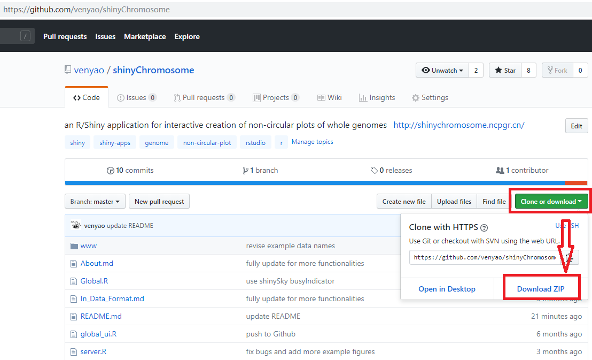

<h1><center> Usage and installation of shinyChromosome </center></h1>

This is the repository for the Shiny application presented in "shinyChromosome: an R/Shiny application for interactive creation of non-circular plots of whole genomes" (Yu et al. 2018).

*****


#	Use shinyChromosome online

shinyChromosome is deployed at http://150.109.59.144:3838/shinyChromosome/, http://shinychromosome.ncpgr.cn/ and https://yimingyu.shinyapps.io/shinychromosome/ for online use.  
shinyChromosome is idle until you activate it by accessing the URLs.  
So, it may take some time when you access this URL for the first time.   
Once it was activated, shinyChromosome could be used smoothly and easily.

*****

#	Launch shinyChromosome directly from R and GitHub

User can choose to run shinyChromosome installed on local computers (Windows, Mac or Linux) for a more preferable experience.

**Step 1: Install R and RStudio**

Before running the app you will need to have R and RStudio installed (tested with <font color="red">R 3.5.0</font> and RStudio 1.1.419).  
Please check CRAN (https://cran.r-project.org/) for the installation of R.  
Please check https://www.rstudio.com/ for the installation of RStudio.  

**Step 2: Install the R Shiny package and other packages required by shinyChromosome**

Start an R session using RStudio and run these lines:  
```
# try an http CRAN mirror if https CRAN mirror doesn't work
install.packages("shiny")
install.packages("rlang")
install.packages("gplots")
install.packages("ggplot2")
install.packages("plyr")
install.packages("ggthemes")
install.packages("RLumShiny")
install.packages("RColorBrewer")
install.packages("gridExtra")
install.packages("reshape2")
install.packages("data.table")
install.packages("shinythemes")
install.packages("shinyBS")
install.packages("markdown")
# install shinysky  
install.packages("devtools")  
devtools::install_github("venyao/ShinySky", force=TRUE)  
```

**Step 3: Start the app**  

Start an R session using RStudio and run these lines:  
```
shiny::runGitHub("shinyChromosome", "venyao")  
```
This command will download the code of shinyChromosome from GitHub to a temporary directory of your computer and then launch the shinyChromosome app in the web browser. Once the web browser was closed, the downloaded code of shinyChromosome would be deleted from your computer. Next time when you run this command in RStudio, it will download the source code of shinyChromosome from GitHub to a temporary directory again. This process is frustrating since it takes some time to download the code of shinyChromosome from GitHub.  

Users are suggested to download the source code of shinyChromosome from GitHub to a fixed directory of your computer, such as 'E:\apps' on Windows. Following the procedure illustrated in the following figure, a zip file named 'shinyChromosome-master.zip' would be downloaded to the disk of your computer. Move this file to 'E:\apps' and unzip this file. Then a directory named 'shinyChromosome-master' would be generated in 'E:\apps'. The scripts 'server.R' and 'ui.R' could be found in 'E:\apps\shinyChromosome-master'.  
<br>
  
<br>

Then you can start the shinyChromosome app by running these lines in RStudio.  
```
library(shiny)
runApp("E:/apps/shinyChromosome-master", launch.browser = TRUE)
```

*****

#	Deploy shinyChromosome on local or web Linux server

**Step 1: Install R**  

Please check CRAN (https://cran.r-project.org/) for the installation of R.

**Step 2: Install the R Shiny package and other packages required by shinyChromosome**  

Start an R session and run these lines in R:  
```
# try an http CRAN mirror if https CRAN mirror doesn't work  
install.packages("shiny")
install.packages("rlang")
install.packages("gplots")
install.packages("ggplot2")
install.packages("plyr")
install.packages("ggthemes")
install.packages("RLumShiny")
install.packages("RColorBrewer")
install.packages("gridExtra")
install.packages("reshape2")
install.packages("data.table")
install.packages("shinythemes")
install.packages("shinyBS")
install.packages("markdown")
# install shinysky  
install.packages("devtools")  
devtools::install_github("venyao/ShinySky", force=TRUE)  
```

For more information, please check the following pages:  
https://cran.r-project.org/web/packages/shiny/index.html  
https://github.com/rstudio/shiny  
https://shiny.rstudio.com/  

**Step 3: Install Shiny-Server**

Please check the following pages for the installation of shiny-server.  
https://www.rstudio.com/products/shiny/download-server/  
https://github.com/rstudio/shiny-server/wiki/Building-Shiny-Server-from-Source  

**Step 4: Upload files of shinyChromosome**

Put the directory containing the code and data of shinyChromosome to /srv/shiny-server.  

**Step 5: Configure shiny server (/etc/shiny-server/shiny-server.conf)**

```
# Define the user to spawn R Shiny processes
run_as shiny;

# Define a top-level server which will listen on a port
server {  
  # Use port 3838  
  listen 3838;  
  # Define the location available at the base URL  
  location /shinychromosome {  
    # Directory containing the code and data of shinyChromosome  
    app_dir /srv/shiny-server/shinyChromosome;  
    # Directory to store the log files  
    log_dir /var/log/shiny-server;  
  }  
}  
```

**Step 6: Change the owner of the shinyChromosome directory**

```
$ chown -R shiny /srv/shiny-server/shinyChromosome  
```

**Step 7: Start Shiny-Server**

```
$ start shiny-server  
```

Now, the shinyChromosome app is available at http://IPAddressOfTheServer:3838/shinyChromosome/.  


